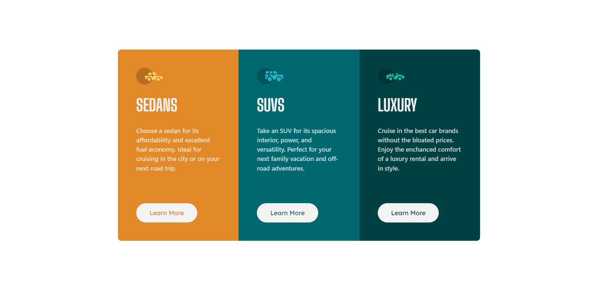
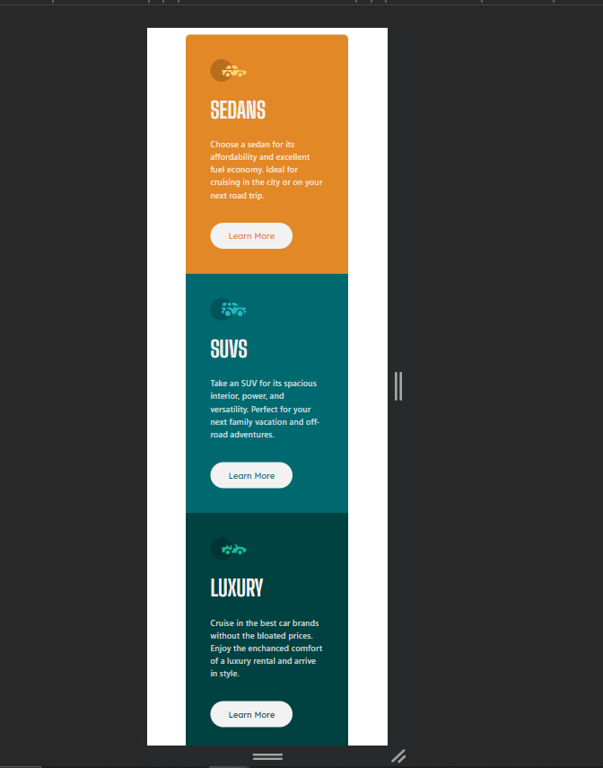

## Table of contents

- [Overview](#overview)
  - [The challenge](#the-challenge)
  - [Screenshot](#screenshot)
  - [Links](#links)
- [My process](#my-process)
  - [Built with](#built-with)
  - [What I learned](#what-i-learned)
  - [Continued development](#continued-development)
  - [Useful resources](#useful-resources)
- [Author](#author)

## Overview

### The challenge

### Links

- [Repo Link](https://your-solution-url.com)
- [Live Link](https://your-live-site-url.com)

## My process

### Built with

- Flexbox
- Mobile-first workflow
- [React](https://reactjs.org/) - JS library
  -Tailwind Css
- For styles

### What I learned

Understood about the layout and responsiveness of working with different screen sizes using tailwind css.

## Author

- Website - [Md. Sonu Alam](https://renon-portfolio-kappa-one.vercel.app/)
- Frontend Mentor - [@yourusername](https://www.frontendmentor.io/profile/yourusername)
- Twitter - [@yourusername](https://twitter.com/muhammadsonu15)
